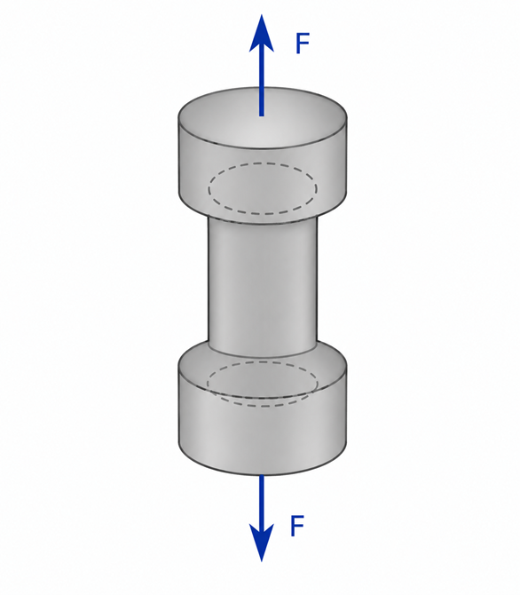
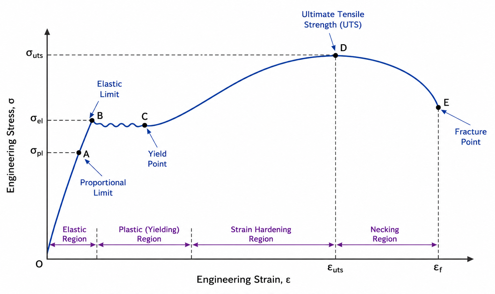

### Introduction

A tensile test is one of the most fundamental mechanical tests used to determine the behaviour of a material when subjected to an axial tensile load. During the test, a standard specimen is gradually pulled until it deforms and eventually fractures.

The tensile test provides important information about the strength, stiffness, ductility, and deformation characteristics of engineering materials. These properties are essential for material selection and structural design.

The experiment is commonly performed using a Universal Testing Machine (UTM), which applies a controlled tensile force while measuring the corresponding elongation of the specimen.

### Physical Concept

When a material is subjected to an axial tensile force, equal and opposite forces act along the longitudinal axis of the specimen. These external forces create internal resisting forces that are distributed over the cross-sectional area of the specimen, producing tensile stress.

As the applied load increases, the specimen elongates and experiences tensile strain. Initially, the material behaves elastically and returns to its original dimensions when the load is removed. Beyond the elastic limit, permanent (plastic) deformation begins, and continued loading eventually causes fracture.

The tensile test studies this complete load–deformation behaviour and provides the stress–strain relationship of the material.

**Figure 1. Concept of axial tensile loading acting on a specimen.**

Equal and opposite axial forces produce tensile stress within the specimen, causing it to elongate. In the actual experiment, the specimen is held between the grips of a Universal Testing Machine (UTM), which applies these tensile forces in a controlled manner.

### Everyday Intuition

Many objects around us experience tensile loading in daily life.

Examples include:

- Suspension bridge cables supporting traffic loads.
- Crane ropes lifting heavy loads.
- Reinforcement bars resisting tensile forces in concrete structures.
- Steel wires used in elevators.

In each case, the material must safely withstand tensile forces without failure.

### Experimental Relevance

The tensile test is performed to determine the mechanical properties of engineering materials and evaluate their suitability for practical applications.

The test helps determine:

- Young's Modulus
- Yield Strength
- Ultimate Tensile Strength (UTS)
- Percentage Elongation
- Percentage Reduction in Area
- Ductility

These properties are widely used in the design of buildings, bridges, machine components, pressure vessels, and other structural systems.

### Apparatus and Working Principle

The experiment is performed using a Universal Testing Machine (UTM).

The major components are:

- Loading frame
- Fixed grip
- Movable grip
- Load measuring system
- Extensometer or dial gauge
- Control panel

A standard specimen is securely gripped between the machine jaws. A gradually increasing tensile load is applied while the corresponding elongation is measured. The collected data are used to construct the engineering stress–strain curve of the material.

### Mathematical Formulation

#### Stress

Stress is defined as the applied load divided by the original cross-sectional area.

$$
\sigma=\frac{P}{A}
$$

where

- $\sigma$ = Stress (N/mm² or MPa)
- $P$ = Applied load (N)
- $A$ = Original cross-sectional area (mm²)

#### Strain

Strain is the ratio of change in length to the original gauge length.

$$
\epsilon=\frac{\Delta L}{L}
$$

where

- $\epsilon$ = Strain
- $\Delta L$ = Extension of the specimen
- $L$ = Original gauge length

Strain is a dimensionless quantity.

#### Young's Modulus

Within the elastic region, stress is directly proportional to strain according to Hooke's Law.

$$
\sigma=E\epsilon
$$

Therefore,

$$
E=\frac{\sigma}{\epsilon}
$$

where

- $E$ = Young's Modulus (N/mm² or GPa)

Young's Modulus represents the stiffness of the material.

### Stress–Strain Behaviour

The engineering stress–strain curve obtained during a tensile test represents the complete mechanical behaviour of a material under tensile loading. It identifies the different stages of deformation and helps determine important mechanical properties such as the proportional limit, elastic limit, yield strength, ultimate tensile strength, and fracture point.

**Figure 2. Typical engineering stress–strain curve for a ductile material (e.g., mild steel).**

#### Proportional Region

Stress is directly proportional to strain and Hooke's Law is valid.

#### Elastic Region

The material returns to its original dimensions after unloading.

#### Yield Point

Plastic deformation begins and permanent deformation occurs.

#### Strain Hardening Region

Additional stress is required to continue plastic deformation.

#### Ultimate Tensile Strength (UTS)

The maximum engineering stress attained during the test.

#### Necking Region

Localized reduction in cross-sectional area occurs.

#### Fracture Point

The specimen breaks and the test ends.

### Ductile and Brittle Materials

#### Ductile Materials

Examples

- Mild Steel
- Aluminium
- Copper

Characteristics

- Significant plastic deformation before fracture.
- Large percentage elongation.
- Distinct yielding behaviour.

#### Brittle Materials

Examples

- Cast Iron
- Concrete
- Glass

Characteristics

- Very little plastic deformation.
- Sudden fracture.
- No pronounced yielding region.

### Engineering Significance

Tensile testing is one of the most important material characterization methods used in engineering practice.

The results of a tensile test help engineers:

- Select suitable construction materials.
- Predict structural performance.
- Establish allowable design stresses.
- Compare material quality.
- Verify compliance with engineering standards.

Therefore, tensile testing forms the basis for the safe and economical design of structural and mechanical systems.
